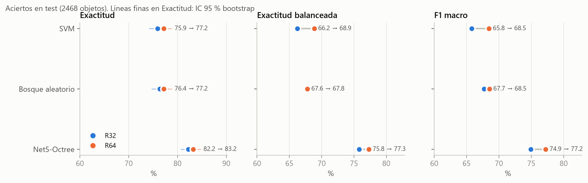
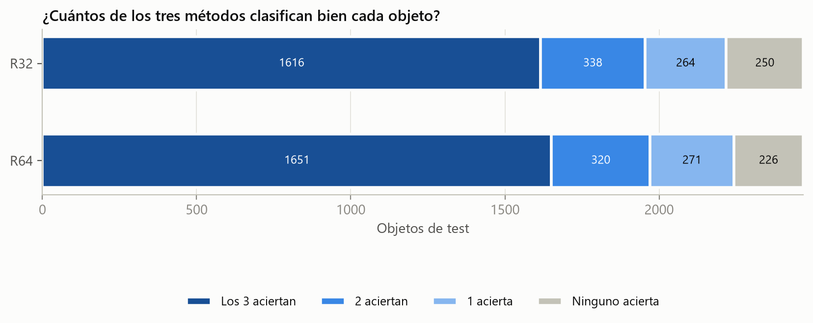
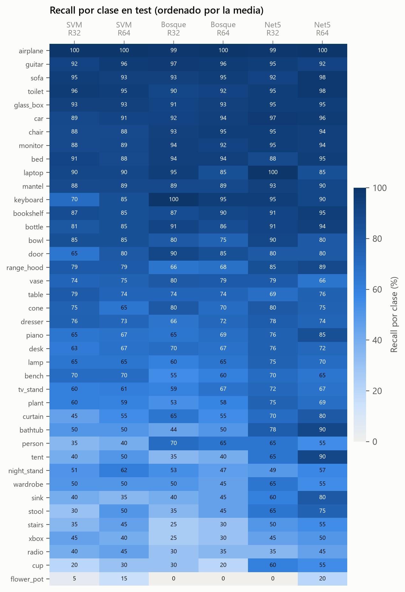
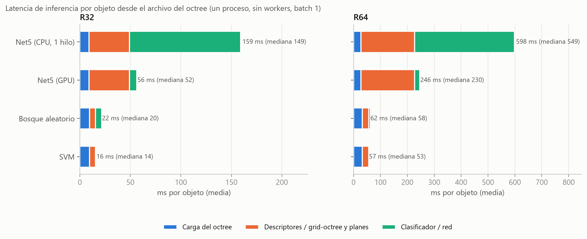
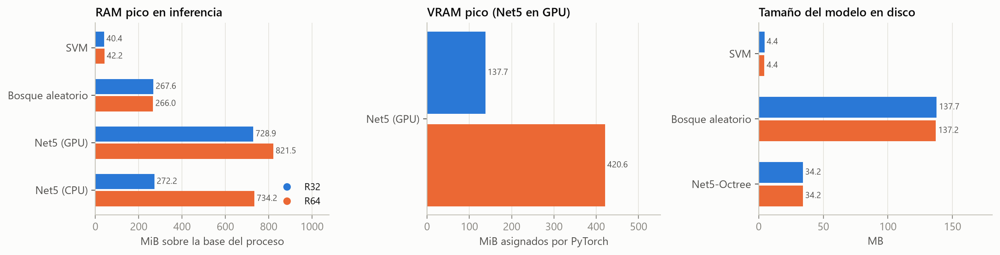
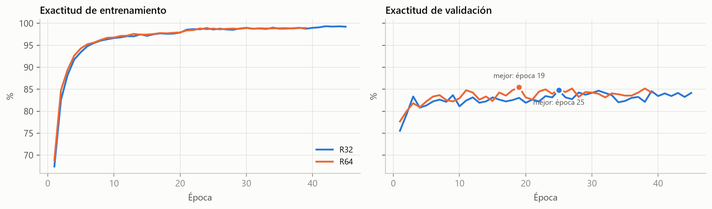
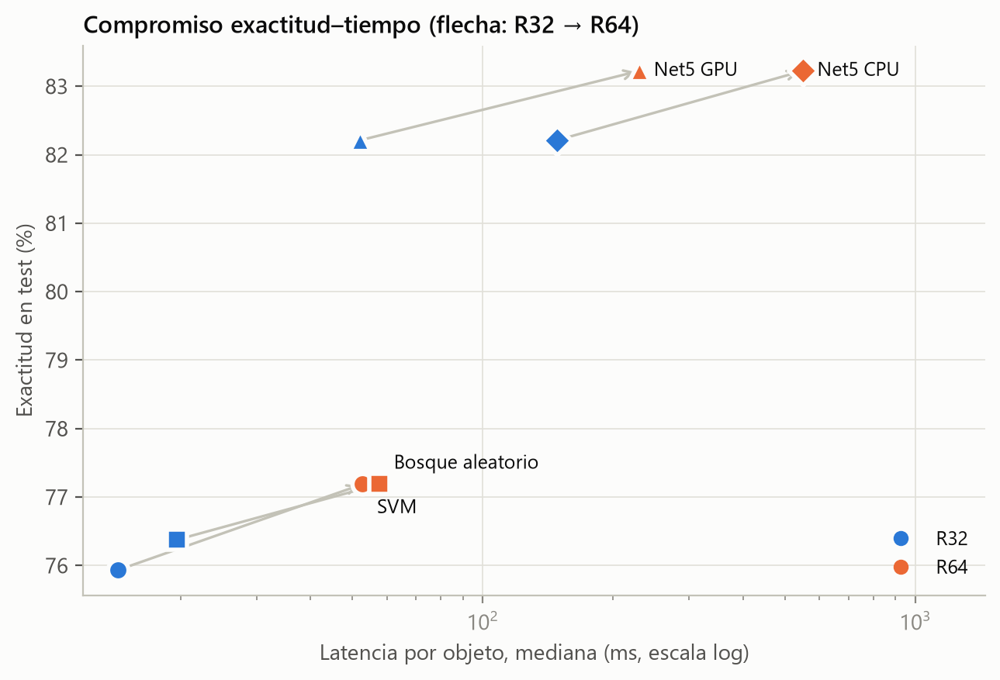

# Comparación de SVM, Bosque Aleatorio y Net5-Octree en R32 y R64

Evaluación de los tres métodos de clasificación de ModelNet40 (40 clases) sobre octrees, en dos resoluciones (32³ y 64³), usando los modelos ya entrenados en los objetivos 2 y 3. Se comparan aciertos, errores, tiempos de inferencia, memoria y tamaño de los modelos, y se discute si aumentar la resolución compensa su costo.

Todas las cifras se obtuvieron sobre los **2,468 objetos de test** de ModelNet40, con la **misma partición** para los tres métodos (verificada objeto por objeto).

## Resumen

| | SVM | Bosque aleatorio | Net5-Octree |
|---|---|---|---|
| Exactitud R32 → R64 | 75.9 → 77.2 % | 76.4 → 77.2 % | **82.2 → 83.2 %** |
| F1 macro R32 → R64 | 65.8 → 68.5 % | 67.7 → 68.5 % | **74.9 → 77.2 %** |
| Latencia por objeto, mediana, R32 → R64 | **14 → 53 ms** | 20 → 58 ms | 52 → 230 ms (GPU) |
| Tamaño del modelo | **4.4 MB** | 137 MB | 34 MB |
| RAM pico de inferencia (sobre la base) | **~40 MiB** | ~270 MiB | 730-820 MiB (GPU) |
| Entrenamiento | ~16 s + extracción | <1 s + extracción | 3-8 h en GPU |

1. **Net5-Octree es el más preciso** en las dos resoluciones: +5-6 puntos de exactitud y +7-9 puntos de F1 macro sobre los métodos clásicos, con diferencias estadísticamente significativas (McNemar, p < 10⁻¹¹). Su ventaja se concentra en las clases pequeñas y difíciles.
2. **SVM y Bosque aleatorio empatan** entre sí (p = 0.59 en R32 y p = 1 en R64), y son **entre 2.6 y 4.4 veces más rápidos** que Net5 en GPU. SVM es además el más ligero en disco y en memoria.
3. **Subir de R32 a R64 mejora poco y cuesta mucho:** +0.8 a +1.3 puntos de exactitud (solo significativo en SVM), a cambio de 2.9-4.4 veces más latencia, el doble de espacio en disco para los octrees y ~2.8 veces más tiempo de entrenamiento de Net5.

---

## 1. Organización

### 1.1 Esta carpeta

```
Objetivos_4_y_5_comparacion/
├── README.md                   este documento
├── SHA256SUMS.txt              hashes de modelos y datos
├── modelos/
│   ├── hce/                    hce_svm_R32/R64.joblib, hce_rf_R32/R64.joblib
│   └── net5/                   net5_octree_mejor_R32/R64.pth (mejores pesos)
├── datos/
│   ├── hce_features_R32/R64.npz    descriptores HCE de train y test
│   ├── contrato_hce_R32/R64.json   orden y definición de los descriptores
│   └── particion_objetivo2_modelos.json  partición común por ID de objeto
├── resultados/
│   ├── oficiales/              resúmenes de entrenamiento de HCE y Net5 e historiales de Net5
│   ├── predicciones_R32/R64.csv    predicción de los 3 métodos para cada objeto de test
│   ├── tiempos_por_objeto_R32/R64.csv
│   ├── tiempos.json, memoria.json, analisis.json
│   └── recall_por_clase.csv
├── tablas/                     t1 a t7 (CSV y Markdown)
└── figuras/                    fig1 a fig7 (PNG)
```

Los scripts que generan todo esto están en el repositorio, en `Tesis/fase4_comparacion/` (sección 1.2). Esta carpeta solo guarda modelos, datos y resultados, que son demasiado pesados para git (339 MB).

### 1.2 Código en el repositorio

Repositorio: <https://github.com/ricardoal94/Octree>, rama `feature/octnet-native-backend`, commit `8164428f3`.

| Etapa | Carpeta | Archivos principales |
|---|---|---|
| Objetivo 1: octrees | `fase2_octree/` | `preprocesar_octrees.py`, `octree_real.py` |
| Objetivo 2: HCE, SVM y Bosque aleatorio | `fase3_hce/` | `auditar_train_hce.py`, `contrato_hce.py`, `hce_extraccion.py`, `fase3_hce_entrenamiento.py` |
| Objetivo 3: Net5-Octree | `fase3_net5/` | `grid_octree.py`, `octnet_backend.py`, `net5_modelo.py`, `fase3_net5_entrenamiento.py`, `ejecutar_objetivo3_net5.py` |
| Objetivos 4 y 5: comparación | `fase4_comparacion/` | `evaluar_comparacion.py` (predicciones, tiempos, memoria y análisis), `tablas_comparacion.py`, `figuras_comparacion.py` |
| Partición común | `fase3_net5/particion_objetivo2.py` | Lista los octrees en orden canónico y fija train/val/test por ID |
| Pruebas | `tests/` | 103 pruebas (`python -m pytest`) |

### 1.3 Modelos y resultados originales

| Qué | Ubicación original |
|---|---|
| Octrees de ModelNet40 | `Tesis/data/octrees_32/`, `octrees_64/` (12,311 objetos cada uno) |
| Modelos HCE | `Tesis/checkpoints/hce_{svm,rf}_R{32,64}.joblib` |
| Resultados HCE | `Tesis/resultados/objetivo2/` |
| Modelos y resultados Net5 | `Tesis_objetivo3_oficial_8164428/` (checkpoints, logs y resultados) |
| Barrido de workers | `Tesis_smoke_workers_8164428/resultados/` |

Las copias de `modelos/` y `datos/` en esta carpeta son idénticas byte a byte (`SHA256SUMS.txt`).

---

## 2. Cómo repetir los experimentos

**Entorno usado:** Windows 11, AMD Ryzen de 8 núcleos y 16 hilos, 32 GB de RAM, NVIDIA RTX 5070 (12 GB), Python 3.14.4, PyTorch 2.11.0+cu128, scikit-learn 1.9.0, numpy 2.4.6 y numba 0.67.0. Los comandos se ejecutan en PowerShell desde la raíz del repositorio (`Tesis`), con su venv activo.

### 2.1 Desde cero (octrees y entrenamientos)

```powershell
# Objetivo 1: octrees de ModelNet40 en R32 y R64
python fase2_octree/preprocesar_octrees.py --dataset-root Dataset/ModelNet40 `
  --output-root data --resultados-dir resultados/objetivo1 `
  --resoluciones 32 64 --n-puntos 20000 --semilla 42 --procesos 8 --sobrescribir

# Objetivo 2: HCE + SVM + Bosque aleatorio (ver fase3_hce/README_OBJETIVO2.md)
python fase3_hce/fase3_hce_entrenamiento.py --resolucion 32 --data-root data `
  --contrato-features resultados/objetivo2/contrato_hce_R32.json --resultados-dir resultados/objetivo2
python fase3_hce/fase3_hce_entrenamiento.py --resolucion 64 --data-root data `
  --contrato-features resultados/objetivo2/contrato_hce_R64.json --resultados-dir resultados/objetivo2

# Objetivo 3: Net5-Octree (barrido de workers y entrenamiento oficial de R32 y R64)
python fase3_net5/comparar_workers_octnet.py --artefactos-dir ..\Tesis_smoke_workers_<commit>
python fase3_net5/ejecutar_objetivo3_net5.py --barrido-dir ..\Tesis_smoke_workers_<commit> `
  --artefactos-dir ..\Tesis_objetivo3_oficial_<commit> --lr 0.0001
```

El flujo oficial de Net5 exige el árbol de git limpio y el commit publicado. Usa batch 1, LR 1e-4 y 8 workers; el motivo del LR está en `..\CAMBIOS_ACELERACION_NET5.md`.

### 2.2 Esta evaluación (con los modelos ya entrenados)

Desde la raíz del repositorio (`Tesis`):

```powershell
python fase4_comparacion/evaluar_comparacion.py   # 20-30 min: predicciones, tiempos, memoria y análisis
python fase4_comparacion/tablas_comparacion.py
python fase4_comparacion/figuras_comparacion.py
```

Por defecto los tres leen y escriben en `..\Objetivos_4_y_5_comparacion` (esta carpeta, junto al repositorio). Para usar otra ubicación se pasa `--carpeta RUTA`; debe contener `modelos/hce`, `modelos/net5`, `datos/` y `resultados/oficiales/`. Con `--etapas` se ejecuta una sola parte de la evaluación, por ejemplo `--etapas tiempos`. La etapa de predicciones comprueba que los seis modelos reproducen la exactitud oficial: **coinciden los seis**.

---

## 3. Protocolo de evaluación

| Aspecto | Protocolo |
|---|---|
| **Aciertos** | Los 2,468 objetos de test. Exactitud con IC 95 % bootstrap (2,000 remuestreos), exactitud balanceada (media del recall por clase), F1 macro y ponderado. |
| **Diferencias** | McNemar exacto sobre los objetos en que un modelo acierta y el otro no. |
| **Tiempos** | 400 objetos de test (10 por clase, o todos si la clase tiene menos). Un proceso, **sin DataLoader ni workers, un objeto a la vez**, empezando en el archivo `.npz` del octree. 10 objetos de calentamiento descartados. Se reportan mediana y percentil 95. |
| **Memoria** | Cada caso en un proceso nuevo, con 100 objetos. RAM = working set de Windows muestreado cada 2 ms, reportado como incremento sobre la base tras importar las bibliotecas. VRAM = `torch.cuda.max_memory_allocated` / `reserved`. |
| **Tamaño** | Tamaño del archivo del modelo en disco (MB = 10⁶ bytes). |

Decisiones que conviene conocer:

- **Hilos:** todas las bibliotecas numéricas se limitan a 1 hilo (la misma política que el entrenamiento oficial). Net5 en CPU se midió **con un solo hilo**; con más hilos su forward sería más rápido.
- **Bosque aleatorio:** está guardado con `n_jobs=-1`. Para la latencia por objeto se usó `n_jobs=1`: con un solo objeto, repartir el trabajo entre hilos cuesta más de lo que ahorra. Las predicciones no cambian.
- **Net5 en GPU y en CPU** dieron **la misma predicción en los 400 objetos** de ambas resoluciones.
- La latencia por objeto **no es el throughput de entrenamiento o inferencia masiva**. Con el DataLoader de 8 workers, Net5 procesa un objeto cada **15.5 ms en R32** y cada **64.5 ms en R64** (resumen oficial), porque la preparación de los octrees se reparte entre núcleos.

---

## 4. Resultados

### 4.1 Aciertos y errores



| Método | Res. | Aciertos | Errores | Exactitud (%) | IC 95 % | Exactitud balanceada (%) | F1 macro (%) | F1 ponderado (%) |
|---|---|---|---|---|---|---|---|---|
| SVM | R32 | 1874 | 594 | 75.93 | [74.2, 77.6] | 66.24 | 65.82 | 75.47 |
| SVM | R64 | 1905 | 563 | 77.19 | [75.4, 78.8] | 68.86 | 68.47 | 76.91 |
| Bosque aleatorio | R32 | 1885 | 583 | 76.38 | [74.8, 78.0] | 67.64 | 67.72 | 75.43 |
| Bosque aleatorio | R64 | 1905 | 563 | 77.19 | [75.5, 78.8] | 67.80 | 68.53 | 76.35 |
| **Net5-Octree** | R32 | 2029 | 439 | **82.21** | [80.7, 83.7] | **75.81** | **74.93** | **81.99** |
| **Net5-Octree** | R64 | 2054 | 414 | **83.23** | [81.8, 84.7] | **77.29** | **77.23** | **83.38** |

- La **exactitud balanceada** y el **F1 macro** están 6-10 puntos por debajo de la exactitud en todos los métodos. ModelNet40 está desbalanceado: varias clases tienen solo 20 objetos de test, frente a 100 en otras, y esas clases pequeñas son las más difíciles.
- **Net5 reduce la brecha en las clases pequeñas:** su exactitud balanceada supera en 8-10 puntos a la de los clásicos, mientras que en exactitud global la diferencia es de 6 puntos (5.8-6.3).

**¿Las diferencias son reales?** Prueba de McNemar exacta:

| Comparación (A vs B) | Solo A acierta | Solo B acierta | p | Significativa (α = 0.05) |
|---|---|---|---|---|
| Net5-Octree vs SVM (R32) | 297 | 142 | 1.1e-13 | sí |
| Net5-Octree vs Bosque aleatorio (R32) | 282 | 138 | 1.8e-12 | sí |
| Bosque aleatorio vs SVM (R32) | 178 | 167 | 0.59 | no |
| Net5-Octree vs SVM (R64) | 289 | 140 | 5.3e-13 | sí |
| Net5-Octree vs Bosque aleatorio (R64) | 293 | 144 | 8.7e-13 | sí |
| Bosque aleatorio vs SVM (R64) | 158 | 158 | 1 | no |
| SVM: R64 vs R32 | 110 | 79 | 0.029 | sí |
| Bosque aleatorio: R64 vs R32 | 102 | 82 | 0.16 | no |
| Net5-Octree: R64 vs R32 | 125 | 100 | 0.11 | no |

**Errores compartidos y complementarios:**



| Res. | Los 3 aciertan | 2 aciertan | 1 acierta | Ninguno | Solo Net5 acierta | Net5 falla y algún HCE acierta | Al menos uno acierta |
|---|---|---|---|---|---|---|---|
| R32 | 1616 | 338 | 264 | 250 | 166 | 189 | 89.9 % |
| R64 | 1651 | 320 | 271 | 226 | 179 | 188 | 90.8 % |

Los métodos **no fallan en los mismos objetos**. En ~190 objetos Net5 falla pero algún método clásico acierta, y en al menos uno de los tres aciertan el ~90 % de los objetos, frente al 83 % del mejor modelo individual. Eso sugiere que combinar enfoques clásicos y profundos tiene margen, aunque aquí no se evaluó ningún ensamble.

**Confusiones más frecuentes:** las mismas en los tres métodos, entre clases geométricamente parecidas:

| Método | Res. | Confusiones más frecuentes (real → predicha, n) |
|---|---|---|
| SVM | R32 | night_stand→dresser (21); bottle→vase (15); vase→bottle (15); table→desk (14) |
| Bosque aleatorio | R32 | table→desk (21); dresser→night_stand (19); bathtub→bed (17); night_stand→dresser (17) |
| Net5-Octree | R32 | table→desk (28); night_stand→dresser (26); dresser→night_stand (13); desk→table (12) |
| SVM | R64 | table→desk (20); night_stand→dresser (18); bottle→vase (14); vase→bottle (14) |
| Bosque aleatorio | R64 | night_stand→dresser (25); table→desk (20); bathtub→bed (12); bottle→vase (12) |
| Net5-Octree | R64 | night_stand→dresser (21); dresser→night_stand (18); table→desk (17); plant→flower_pot (15) |

**Por clase:**



- **Net5 iguala o supera al mejor método clásico en 27 de 40 clases en R32 y en 30 de 40 en R64.** Sus mayores ventajas están en clases con estructura fina o poco frecuentes: tent (+40 puntos en R64), bathtub (+40), sink (+35), cup (+25) y stool (+25).
- Los clásicos solo superan claramente a Net5 en unas pocas clases: vase (−13 en R64), person (−10), table (−10 en R32) y door (−10 en R32).
- **flower_pot** es prácticamente irreconocible para todos (0-20 %): se confunde con plant y vase, que tienen formas casi idénticas.

### 4.2 Tiempos de inferencia



| Método | Res. | Carga (ms) | Descriptores / preparación (ms) | Clasificador / red (ms) | Total mediana (ms) | Total p95 (ms) |
|---|---|---|---|---|---|---|
| SVM | R32 | 8.3 | 5.0 | 0.82 | **14.3** | 34.6 |
| SVM | R64 | 27.6 | 23.0 | 0.82 | **52.7** | 118.8 |
| Bosque aleatorio | R32 | 8.3 | 5.0 | 5.88 | 19.7 | 40.8 |
| Bosque aleatorio | R64 | 27.6 | 23.0 | 5.77 | 57.7 | 123.8 |
| Net5-Octree (GPU) | R32 | 7.3 | 37.5 | 5.91 | 52.1 | 105.4 |
| Net5-Octree (GPU) | R64 | 24.9 | 187.9 | 11.81 | 230.1 | 462.9 |
| Net5-Octree (CPU, 1 hilo) | R32 | 7.3 | 37.5 | 102.65 | 148.5 | 312.4 |
| Net5-Octree (CPU, 1 hilo) | R64 | 24.9 | 187.9 | 334.87 | 549.1 | 1090.2 |

- **El clasificador en sí es lo más barato** en los métodos clásicos: 0.8 ms el SVM y ~6 ms el bosque. Casi todo el tiempo va a leer el octree y calcular los descriptores.
- **En Net5 domina la preparación geométrica** (convertir a grid-octree y construir los planes de convolución): 38 ms en R32 y 188 ms en R64. El forward en GPU solo cuesta 6-12 ms. En CPU, con un hilo, el forward pasa a dominar (103-335 ms).
- **La resolución multiplica el costo** de todos los métodos, porque el octree de R64 tiene ~4.3 veces más hojas (15,310 frente a 3,579 de media en el grid-octree de Net5).

### 4.3 Memoria y tamaño de los modelos



| Método | Res. | Archivo (MB) | Complejidad | RAM del modelo cargado (MiB) | RAM pico sobre la base (MiB) | RAM pico del proceso (MiB) | VRAM pico asignada / reservada (MiB) |
|---|---|---|---|---|---|---|---|
| SVM | R32 | **4.4** | 5,765 vectores de soporte | 8 | **40** | 161 | — |
| SVM | R64 | **4.4** | 5,662 vectores de soporte | 8 | **42** | 163 | — |
| Bosque aleatorio | R32 | 137.7 | 100 árboles, 358,494 nodos | 143 | 268 | 388 | — |
| Bosque aleatorio | R64 | 137.2 | 100 árboles, 356,984 nodos | 142 | 266 | 387 | — |
| Net5-Octree (GPU) | R32 | 34.2 | 8,547,456 parámetros | 67 | 729 | 1309 | 138 / 300 |
| Net5-Octree (GPU) | R64 | 34.2 | 8,547,456 parámetros | 67 | 821 | 1402 | 421 / 1972 |
| Net5-Octree (CPU) | R32 | 34.2 | 8,547,456 parámetros | 67 | 272 | 852 | — |
| Net5-Octree (CPU) | R64 | 34.2 | 8,547,456 parámetros | 67 | 734 | 1314 | — |

- **El tamaño del modelo no depende de la resolución** en ninguno de los tres métodos. Net5 tiene exactamente la misma arquitectura en R32 y R64, y los clásicos usan 17-18 descriptores.
- **SVM es el más ligero en todo.** El **bosque es el modelo más grande en disco** (137 MB), 4 veces más que Net5. Su pico de RAM (~268 MiB) duplica el tamaño del modelo porque, al cargarlo, joblib necesita temporalmente memoria extra.
- **Net5 es el que más memoria usa en ejecución.** En GPU, parte del incremento es fijo: el contexto de CUDA (~148 MiB). En CPU, **la memoria sí crece con la resolución** (272 → 734 MiB), por los planes de convolución de R64. La VRAM pico asignada se triplica al pasar de R32 a R64 (138 → 421 MiB).
- Los valores de **RAM pico del proceso** incluyen el intérprete y las bibliotecas. PyTorch sola ocupa ~580 MiB de base, frente a ~120 MiB de scikit-learn.

### 4.4 Costo de entrenamiento y de los datos



| Res. | Octrees de ModelNet40 en disco | Extracción HCE del train | SVM (búsqueda de hiperparámetros) | Bosque aleatorio (ajuste) | Net5-Octree (entrenamiento) | VRAM pico entrenamiento Net5 |
|---|---|---|---|---|---|---|
| R32 | 203 MB (16.1 KB/objeto) | ~2.5 min (estimado) | 15.7 s | 0.49 s | 173 min (45 épocas, mejor 25) | 793 MB |
| R64 | 437 MB (34.6 KB/objeto) | ~9.2 min (estimado) | 17.3 s | 0.49 s | 477 min (39 épocas, mejor 19) | 2524 MB |

- La extracción de descriptores HCE del conjunto de entrenamiento se estima a partir de la latencia medida (carga más descriptores × 9,843 objetos), porque no quedó registrada al entrenar.
- **Entrenar Net5 cuesta 3-8 horas de GPU**, frente a segundos o minutos para los clásicos. Las curvas muestran que Net5 llega al ~99 % en entrenamiento y se estanca en ~84-85 % en validación desde la época 10-15: hay sobreajuste, y el early stopping lo detiene.
- **R64 dobla el espacio de los octrees** y multiplica por ~2.8 el tiempo de entrenamiento de Net5 y por ~3.2 su VRAM pico.

### 4.5 Compromiso exactitud–tiempo



No hay un método que gane en todo. Net5 ocupa la zona de **mayor exactitud y mayor costo**; SVM y Bosque aleatorio, la de **menor costo y menor exactitud**. Las flechas muestran que pasar de R32 a R64 desplaza todos los métodos mucho más a la derecha (tiempo) que hacia arriba (exactitud).

---

## 5. Ventajas y limitaciones

### SVM (sobre descriptores HCE)

- **Ventajas:** el más rápido (14 ms por objeto en R32, 0.8 ms el clasificador) y el más ligero (4.4 MB, ~40 MiB de RAM). Se entrena en segundos, sin GPU. Sus 17-18 descriptores son interpretables.
- **Limitaciones:** 6-7 puntos menos de exactitud que Net5 y el F1 macro más bajo (65.8 % en R32): falla mucho en las clases pequeñas (cup, stool y stairs, entre 20 y 50 %). Su techo depende de la calidad de los descriptores diseñados a mano.

### Bosque aleatorio (sobre descriptores HCE)

- **Ventajas:** exactitud equivalente al SVM (sin diferencia significativa), entrenamiento casi instantáneo (0.5 s) e importancia de cada descriptor disponible.
- **Limitaciones:** el modelo más pesado en disco (137 MB, 31 veces el SVM) sin ganar exactitud, y ~6 ms por predicción frente a 0.8 ms del SVM. Comparte con el SVM los errores en clases pequeñas.

### Net5-Octree

- **Ventajas:** el más preciso (82-83 %) y el más equilibrado entre clases (F1 macro 75-77 %), con ventaja significativa sobre los dos clásicos. Aprende la geometría directamente del octree, sin descriptores manuales, y distingue clases de estructura fina que los descriptores globales no capturan (tent, bathtub, sink, cup y stool).
- **Limitaciones:**
  - Entrenamiento de 3-8 horas en GPU.
  - Inferencia 2.6-4.4 veces más lenta que los clásicos, dominada por la preparación geométrica en CPU.
  - 730-820 MiB de RAM en ejecución (PyTorch y CUDA incluidos).
  - Sobreajuste marcado (99 % en entrenamiento frente a 84-85 % en validación).
  - En CPU sin GPU es 10 veces más lento que el SVM.

### Comunes a los tres

- Las confusiones dominantes son las mismas: night_stand/dresser, table/desk, bottle/vase y plant/flower_pot. Son clases que se diferencian sobre todo por escala o por detalles que la normalización y la resolución no conservan bien.
- flower_pot queda prácticamente sin reconocer en todos los casos.

---

## 6. ¿Compensa aumentar la resolución de R32 a R64?

| Método | Ganancia en exactitud | Ganancia en F1 macro | ¿Significativa? (McNemar) | Latencia por objeto | RAM de inferencia | Entrenamiento |
|---|---|---|---|---|---|---|
| SVM | +1.3 pts | +2.7 pts | Sí (p = 0.029) | ×3.7 (14 → 53 ms) | Igual | ×1.1 en el ajuste; extracción ~×3.7 |
| Bosque aleatorio | +0.8 pts | +0.8 pts | No (p = 0.16) | ×2.9 (20 → 58 ms) | Igual | Igual en el ajuste; extracción ~×3.7 |
| Net5-Octree | +1.0 pts | +2.3 pts | No (p = 0.11) | ×4.4 (52 → 230 ms, GPU) | +13 % GPU, ×2.7 CPU | ×2.8 (3 h → 8 h), VRAM ×3.2 |

A esto se suma el costo común a todos: **los octrees de R64 ocupan el doble** (203 → 437 MB) y tienen ~4.3 veces más hojas.

**Conclusión: en este experimento, R64 no compensa el costo adicional.**

- La mejora de exactitud es de **1 punto o menos**, y solo es estadísticamente significativa para el SVM. Para Net5 y el Bosque aleatorio no se puede descartar que sea ruido.
- El costo, en cambio, **se multiplica por 3-4** en tiempo de inferencia para los tres métodos, y por ~3 en tiempo y VRAM de entrenamiento para Net5.
- **La diferencia entre métodos pesa mucho más que la resolución:** pasar de un método clásico a Net5 en R32 aporta +5.8 a +6.3 puntos, frente a +1 punto por subir a R64 con el mismo método. Net5 en R32 (82.2 %) supera a cualquier método clásico en R64 (77.2 %), con menos latencia que Net5 en R64.

Matices a esta conclusión:

- La mejora en **F1 macro** es mayor que en exactitud (+2.3 a +2.7 puntos en SVM y Net5): R64 ayuda algo más en clases pequeñas o de detalle fino (Net5: tent +25, sink +20, flower_pot +20). Si esas clases fueran prioritarias, R64 podría justificarse.
- Net5 usa la **misma arquitectura** en ambas resoluciones (misma capacidad, 8.5 M parámetros). Una red diseñada para aprovechar R64 podría obtener más; eso no se evaluó.

---

## 7. Limitaciones de esta evaluación

- **Un solo entrenamiento por modelo** (semilla 42). No se estimó la variabilidad entre semillas; los intervalos de confianza reflejan solo la variabilidad del conjunto de test.
- **Latencias medidas en un solo equipo** y en Windows. Los valores absolutos cambian con el hardware; las proporciones entre métodos son más estables.
- **RAM medida como working set de Windows.** Incluye memoria compartida de las bibliotecas, así que los picos absolutos son aproximados. Los incrementos entre casos son comparables.
- **Net5 en CPU se midió con un hilo** para igualar la política de los clásicos. Con más hilos su forward sería más rápido.
- **El tiempo de extracción HCE del entrenamiento es una estimación.** El de inferencia sí está medido.
- **No se midió el costo de generar los octrees** (objetivo 1), común a los tres métodos.

---

## 8. Archivos generados

| Archivo | Contenido |
|---|---|
| `resultados/predicciones_R{32,64}.csv` | ID del objeto, clase real y predicción de SVM, Bosque y Net5 |
| `resultados/tiempos_por_objeto_R{32,64}.csv` | Desglose de tiempos, número de hojas y predicciones por objeto |
| `resultados/tiempos.json` | Medianas, medias y p95, con el entorno de medición |
| `resultados/memoria.json` | RAM y VRAM de cada caso, con el protocolo |
| `resultados/analisis.json` | Métricas, IC, McNemar, acuerdo, confusiones, costo de los datos y complejidad de los modelos |
| `resultados/recall_por_clase.csv` | Recall de cada clase para los 6 modelos |
| `tablas/t1…t7` | Tablas de este documento en CSV y Markdown |
| `figuras/fig1…fig7` | Figuras de este documento |
